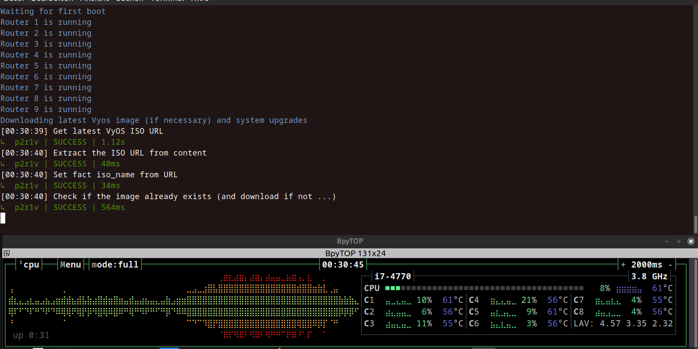
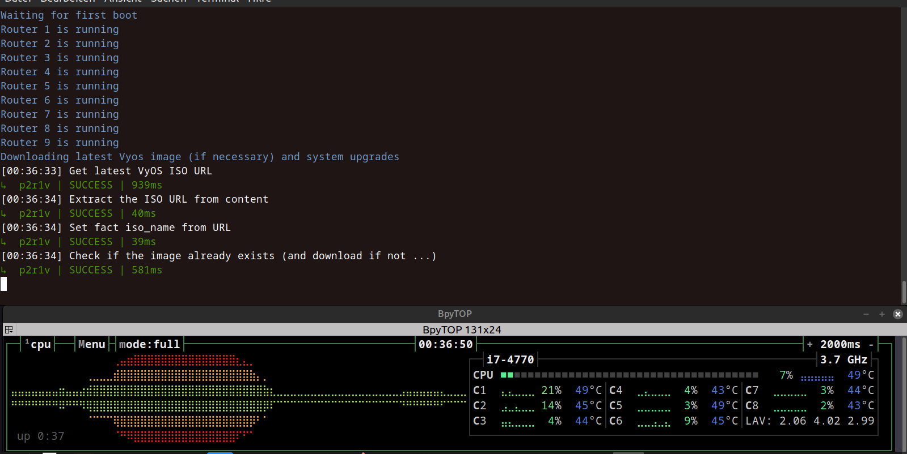

# **Beschreibung und Gebrauchshinweise für den Internet Creator v0.14.2**

## **Inhalt:**

1\. Einleitung

2\. Funktionen

3\. Systemvoraussetzungen: RAM

4\. Grobe Übersicht über den Programmablauf beim Erstellen und Upgrade von VyOS Routern

5\. Übersicht über die drei Modes

6\. Die Unterschiede zwischen dem VyOS Creator und dem Fast VyOS Creator

7\. Gebrauchshinweise

8\. Was ist eine optimale CPU-Auslastung?

8.1 Erfahrungswerte

## **1. Einleitung**

Der _Internet Creator_ ist eine in Flask geschriebene Web App, die dazu dient, drei Netzwerke (ISPs) bestehend aus jeweils 9 VyOS-Routern automatisiert unter PVE aufzusetzen und mit Ansible zu konfigurieren. ISP1 besteht zusätzlich aus 3 MikroTik Routern, die (zumindest vorläufig) über SSH konfiguriert werden.

Der Ordner ```inc``` enthält ein Beispiel-Setup, an dem man ausprobieren kann, wie der _Internet Creator_ arbeitet. Dabei handelt es sich um das denkbar einfachste Setup, nämlich ohne VRF, EVPN oder VXLANs. Es wird auch keine Verbindung zwischen den Providern hergestellt, sondern es geht vorläufig nur darum, die ISPs aufzusetzen. Damit ist es auch für Neueinsteiger, Anfänger, Schüler und Auszubildende gut geeignet. Komplexere Setups sind natürlich für die Zukunft geplant.

Obwohl letztlich jeder einzelne Provider auf einem eigenen Rechner laufen soll und dann drei Rechner zu einem Cluster verbunden werden, findet hier zunächst alles auf nur auf einem einzigen Node statt, was den Vorteil hat, dass man auch vorläufig nur _einen_ Rechner, _einen_ DHCP-Server und _eine_ pfSense braucht. Das Setup INC.md ist allerdings so geschrieben, dass es auch unmittelbar auf einen Aufbau mit drei einzelnen Rechnern übertragbar ist.

## **2. Funktionen**

Die pfSense kann per GUI erstellt werden. Die Installation und Konfiguration muss allerdings händisch erledigt werden. Beim DHCP Server muss zwar auch die Installation händisch ausgeführt werden, Erstellung und Konfiguration können aber über die GUI automatisch erfolgen.

Der _Internet Creator_ ist darauf ausgelegt, sich bzgl. der Arbeitsgeschwindigkeit an die Gegebenheiten verschieden starker CPUs anzupassen. So gibt es für die VyOS Router einen Fast Modus für Rechner mit besonders starken CPUs, einen Normalmodus für schwächere CPUs und einen seriellen Modus für besonders schwache CPUs. Die Erstellung der MikroTiks geht erheblich schneller als die Erstellung der VyOS Router und benötigt auch erheblich geringere CPU-Kapazitäten, sodass es hier nur einen einzigen Modus gibt, der für alle Rechner geeignet ist.

Es gibt einen (erweiterbaren) Filter für unerwünschte Ansible Ausgaben - z.B. irrelevante Warnungen - im Backend (siehe inc.py, Zeile 31).

Es wird automatisch erkannt, ob es sich um ein Ext4, ein Btrfs- oder ein ZFS-Dateisystem handelt, und dementsprechende Skripte ausgeführt.

Es gibt einen Schalter, mit dem man zwischen Darkmode und Lightmode wechseln kann.

Die Linux Bridges vmbr1 bis vmbr3 werden von _pfSense Postinstall_ automatisch angelegt. Im Fall des Clusterverbunds wird pro PVE-Host nur _ein_ LAN automatisch angelegt, im Standalone-Fall alle drei.

Mit dem Ping Test kann man überprüfen, ob alle Router rauspingen können, sodass man sich dafür nicht mehr in jeden extra einloggen muss.

Auf der Seite Router Infos können Informationen über Konfiguration, Routing Tabelle, Routing Regeln, ARP-Tabelle, IPs, Interfaces und VRF einzelner VyOS Router abgerufen werden. Bei den MikroTiks nur Konfiguration, Routing Tabelle, ARP-Tabelle und IPs.

Backup und Restore einzelner Router, Serien von Routern bzw. kompletter Provider sind möglich. Außerdem sind Backup und Restore einzelner VMs anhand ihrer PVE-ID, wie insbesondere des/der DHCP-Server(s) und der pfSense(n), möglich. Falls mehrere Backups für einen Router bzw. eine VM vorhanden sind, wird das neueste Backup dem Restore-Prozess zugrundegelegt. Falls ein älteres Backup verwendet werden soll, muss das Restore über die PVE-Oberfläche veranlasst werden.

Bei der Erstellung von VyOS Routern kann zwischen den Release Typen ```Stream```- stabil, aber nur vierteljährlich aktualisiert - und ```Rolling```- brandaktuell, aber möglicherweise (in relativ seltenen Ausnahmefällen) etwas instabil - gewählt werden.

Bei der Erstellung der VyOS-Rolling Router wird zunächst automatisch festgestellt, ob ein aktuelleres Image verfügbar ist und wenn ja, wird es heruntergeladen. Im Fall des Stream-Release existiert momentan nur eine einzige Version.

Es gibt eine 'standalone' Upgrade-Funktion für VyOS Router außerhalb des Erzeugungsprozesses. Dabei kann wiederum zwischen dem Release Typ ```Stream``` und ```Rolling``` gewählt werden, womit dann auch ein Wechsel vom einen Typ zum anderen möglich ist. (Näheres dazu siehe unter 7. Gebrauchshinweise (14).)

Wenn es noch ein anderes VyOS-Image im Verzeichnis ```bash ~/inc/ansible/vyos-images``` des PVE-Host gibt, wird es nach der Ausführung eines Upgrades gelöscht.
Dann werden nach dem folgenden Reboot (ggf.) alte Images aus den VyOS-Routern gelöscht. Nach diesem Löschen wird angezeigt, welches Image auf den Routern verbleibt. Dadurch befinden sich am Ende jedes Upgrades immer nur aktuelle Images sowohl auf den Routern, als auch auf dem PVE-Host. 

Bei fehlerhaften Eingaben in die Formularfelder und bei erfolgreichen Skriptausführungen erscheinen entsprechende Systemrückmeldungen für 7 Sekunden. (Erfolgsmeldungen nur, wenn der Anwender während der Skriptausführung nicht die Seite verlassen hat, von der aus das Skript aufgerufen worden ist.)

Jeder zu erstellende Router wird vorher zu zerstören versucht. Wenn er nicht existiert, wird dieser Schritt ausgelassen.

Das Ansible-Limit wird automatisch gesetzt.

Das VyOS Cloud Init Image und die seed.iso können automatisiert erstellt werden, wobei zunächst die neueste VyOS Rolling Version automatisch heruntergeladen wird.

## **3. Systemvoraussetzungen: RAM**

Ein aus 1 pfSense, 1 DHCP-Server und 9 VyOS-Routern bestehender Provider benötigt bei Verwendung eines ZFS-Dateisystems im fertig aufgesetztem Zustand je nach Provider 12 bis 13 GB RAM (bei Btrfs etwas weniger). Dabei habe ich die RAM-Größen ziemlich minimalistisch gewählt.

Um ein Upgrade durchführen zu können, benötigt ein VyOS-Router allerdings erheblich mehr RAM als im Normalbetrieb, nämlich knapp 1,5 GB im Gegensatz zu knapp 600 MB. Da während der Installation auch immer ein Upgrade durchgeführt wird, muss bei einem Rechner mit nur 16 GB RAM eine Beschränkung auf die Erstellung (bzw. Upgrade bereits bestehender Router) von höchstens 5 Routern pro Durchlauf eingehalten werden. Diese Beschränkung kann auch durch Nutzung des _Serial Mode_ nicht umgangen werden. Die restlichen Router können dann in einem weiteren Durchgang erstellt bzw. upgegradet werden (wobei währenddessen natürlich die 5 bestehenden Router ausgeschaltet sein müssen).

Ab 20 GB RAM dürfte gerade so genug RAM vorhanden sein, um alle 9 VyOS Router in einem Durchgang aufzusetzen (von mir allerdings nicht getestet).

Den _Internet Creator_ niemals mit Swap verwenden, weil das leicht zu Programmabstürzen führt.

Mit 32 GB RAM ist man auf jeden Fall auf der sicheren Seite, wenn man alle 9 VyOS Router in einem einzigen Durchlauf aufsetzen will.

## **4. Grobe Übersicht über den Programmablauf beim Erstellen und Upgrade von VyOS Routern**

**I Erstellung**

1\) Wenn der zu erstellende Router bereits existiert, wird er erstmal _zerstört_.

2\) Dann wird er _erstellt_, indem das create-vm-vyos.sh Skript aufgerufen wird.

3\) Der Router wird _gestartet_ (erster Boot) und die SSH known hosts werden _geupdatet_.

**II Upgrade**

4\) _Download_ des neuesten Vyos Images (falls nötig)

5a) _Kopieren_ des Images auf die Router

5b) _Installieren_ des Images

**III Cleanup**

6\) Ggf. veraltetes Image aus dem Ordner vyos-images _löschen_.

7\) _Reboot_ (Second Boot)

8\) Ggf. veraltetes Image von Routern _entfernen_

9\) Auf den Routern verbleibendes, aktuelles Image _anzeigen_

**IV Konfiguration**

10\) Router _konfigurieren_

**V Finale**

11\) CD-ROMs _löschen_

12\) Finales _Reboot_

Beim **Upgrade bereits bestehender Router** beschränkt sich der Programmablauf auf die Phasen:

II Upgrade

III Cleanup

## **5. Übersicht über die drei Modes**

Der _VyOS Creator_ und der _Fast Vyos Creator_ arbeiten beide insofern parallel, als die Upgrade- und die Konfigurations-Tasks unter Ansible immer alle aufzusetzenden Router in jeweils einem einzigen Durchgang abarbeiten. Das hat länger anhaltende Lasten während dieser beiden Phasen zur Folge. Der _Serial Mode_ ist für besonders schwache CPUs gedacht, für die diese hohen Lasten während dem Upgrade und der Konfiguration eine zu große Belastung darstellen. Im _Serial Mode_ werden die Upgrade- und die Konfigurations-Tasks immer nur für einen einzigen Router durchgeführt, d.h. der nächste Router kommt (innerhalb eines Playbooks) erst dann dran, wenn das Playbook für den vorigen Router abgeschlossen ist. Diese Vorgehensweise setzt die CPU-Auslastung sehr erheblich herab, was aber natürlich auch länger dauert.

## **6. Die Unterschiede zwischen dem VyOS Creator und dem Fast VyOS Creator**

Es gibt drei Unterschiede zwischen dem normalen Modus des _VyOS Creators_ und dem Fast Modus des _Fast VyOS Creators_, nämlich erstens beim Reboot, zweitens bzgl. des Start Delays - den es im Fast Modus nicht gibt - und drittens in der Konfigurationsphase:

Im ```create_vyos_fast.sh``` gibt es länger anhaltende Lastspitzen insbesondere in der ersten Start-Phase, der Upgrade-Phase und den Reboot-Phasen.

Die langen Lastspitzen beim ersten Start und den Start-Teilen der Reboots ließen sich durch einen frei setzbaren _Start Delay_ kontrollieren, der in einer wählbar langen sleep-Phase am Ende jedes Loop-Durchlaufs besteht. Die Delaywerte werden in der GUI in Sekunden angegeben.

Sehr einfach war auch die Verlangsamung des Shutdowns: Am Ende des ```vyos_upgrade_fast.yml``` wird mittels direktem CLI-Befehl in den Vyos Routern:
```bash
- name: reboot
  cli\_command:
    command: "reboot now"
```
ein stark parallel stattfindender Bulk-Shutdown und -Restart ausgelöst, der eine erhebliche, anhaltende Lastspitze erzeugt. Das habe ich im ```create_vyos.sh``` durch einen Shutdown mittels qm-Befehlen in einem kurzen Shutdown-Skript ersetzt.
```bash
for i in $(seq $first_router $last_router); do
	sudo qm shutdown ${provider}0${provider}00$i
done
```
Der Loop durch die qm-Befehle läuft in einem für schwache Rechner genau richtigen, langsamen Tempo, sodass ein Delay-Parameter gar nicht mehr nötig ist.

Die Lastspitze während des Upgrades ist nur vermeidbar (im Sinne von erheblich verkürzbar), indem der _Serial Mode_ gewählt wird.

Die Konfigurationstasks erzeugen unvermeidlich eine hohe Last, da sie in beiden Modes für alle zu erstellenden Router parallel ausgeführt werden. Im Normalmodus ist aber nach jedem Task eine kleine Verschnaufpause für die CPU von jeweils 1 Sekunde eingeschoben.

## **7. Gebrauchshinweise**

**(1)** Die Datei ```create-vm-vyos.sh``` ist so konfiguriert, dass bei einem Neustart des PVE _kein automatischer Start aller Router_ erfolgt, sondern die Router können über die Start-Funktion unter _Network Controls_ mit einstellbarer Verzögerung gestartet werden, wodurch zu große Lastspitzen bei schwachen Rechnern vermieden werden können.

**(2)** Der _Internet Creator_ wird im Terminal durch den Befehl ```python inc.py``` _aufgerufen_. Es empfiehlt sich, in der .bashrc folgenden _Alias_ zu setzen:
```bash
alias inc='python inc.py'
```
Auf diese Weise muss man allerdings vorher noch zwei weitere Befehle eingeben, was den Startvorgang etwas _umständlich_ macht, nämlich:
```bash
source .venv/bin/activate
cd inc
```
Dies lässt sich folgendermaßen vermeiden: Führe ```./go.sh``` unter ```/home/user/``` aus - noch einfacher mit ```alias go='./go.sh'```in der .bashrc

_Abbrechen_ kann man den _Internet Creator_ durch ```Strg+C```.

**(3)** _Vermutlich_ ist es bei der rein lokalen Nutzung im Heimnetz gar nicht nötig, die Datei ```generate_secret_key.py``` in VSCode auszuführen und den _Secret Key_ in Zeile 11 von ```inc.py``` einzufügen:
```bash
11 app.secret_key = 'y0ur$ecr3t_k3y_w1th_r@ndomCh@racters'
```
Wenn man das aber aus irgendwelchen Gründen machen wollen würde, wird man den Secret Key nicht im Klartext ins Skript schreiben, sondern muss ihn in einer Umgebungsvariable ablegen und diese persistent machen und zwar so:

Zeile 11 im Skript ändern zu
```bash
11 app.secret_key = os.getenv('SECRET_KEY', 'default-secret-key')
```
Folgende Zeile in die ~/.bashrc oder ~/.bash\_profile eintragen:
```bash
export SECRET_KEY='y0ur$ecr3t_k3y_w1th_r@ndomCh@racters'
```
**(4)** Die Verwendung des Skripts ```useradd.sh``` ist notwendig, damit das Skript ```dhcp_configure.sh``` funktioniert, hat darüberhinaus aber auch folgende Vorteile:

1\) Es wird automatisch eine .venv angelegt und alle nötigen Python Pakete installiert, was man sonst händisch machen muss:
```
python3 -m venv .venv
source .venv/bin/activate
pip3 install -U setuptools wheel scp ansible paramiko flask flask-socketio
```
2\) Die spezielle Kombination von .ssh/config- und .bashrc-Einträgen auf dem Steuerungsrechner und dem PVE erlaubt es am Ende, sehr komfortabel per SSH auf die Router zugreifen zu können, indem man z.B. nur **u1** auf dem Steuerungsrechner eingibt (womit man in den PVE-User einloggt) und dann **p1r1v** auf dem PVE, womit man dann sofort auf dem Router ist:

**Steuerungsrechner**:

.ssh/config:
```bash
Host u1
  HostName 192.168.10.11
  User user
```
.bashrc:
```bash
alias u1='ssh u1'
```

**PVE-User**:

.ssh/config:
```bash
Host p1r1v
  HostName 10.20.30.11

Host p*r*v
  User vyos
```
.bashrc:
```
alias p1r1v='ssh p1r1v'
```

**(5)** Wer einen _einzelnen Router_ erstellen, backupen oder restoren möchte, gibt für First Router und Last Router die gleiche Zahl ein.

**(6)** Bei der _Erstellung des Vyos Cloud Init Images_ ist zu beachten:

**(a)** Beim _VyOS Setup_ ist in das Eingabefeld **VM (DHCP Server) IP:** nicht die Management IP einzutragen, sondern diejenige, die mit vmbr0 verbunden ist, in meinem Beispielsetup also 192.168.10.31 \[bzw. 2 oder 3]

**(b)** Momentan ist die VyOS Versionsnummer, so wie sie in das Eingabefeld **Version No:** eingegeben werden muss, **1.5.0**. Bei der Erstellung des VyOS Cloud Init Images über den _Internet Creator_ wird immer die neueste Version verwendet. Wird die falsche Versionsnummer eingetragen, funktioniert die Erstellung von Routern nicht bzw. falls ein älteres vyos\[...].qcow2-Image im Verzeichnis ```/home/user/create-vms/create-vms-vyos``` vorhanden ist - wird weiterhin dieses verwendet.

**(7)** Wer _mehrere öffentliche SSH-Schüssel_ in seinem PVE-User abgespeichert hat, sollte nach der automatischen Erstellung der seed.iso kontrollieren, ob der richtige in die Datei user-data übertragen worden ist. Die Verwendung mehrerer Schlüssel pro User oder mehrerer User ist im Moment nicht vorgesehen, weil ich nicht wüsste, wozu man das brauchen sollte. Wer das trotzdem machen möchte, müsste dann die seed.iso händisch erstellen (oder mir erklären, warum man das brauchen kann, dann versuche ich, das einzubauen).

**(8)**  In alle Felder namens _First Router_ und _Last Router_ sind die Routernummern einzugeben, d.h. für r1v die 1, für r7v die 7 usw.

**(9)** Sowohl bei derAusführung des _useradd.sh_ als auch beim _DHCP Server Postinstall and Configuration_ als auch beim _Create MikroTik_ ist es notwendig, das Terminal-Backend im Auge zu behalten, weil dabei Informationen abgefragt werden, ohne die das Skript nicht durchläuft.

**(10)** Das Konfigurationsskript für den DHCP-Server ist getestet mit Ubuntu-Server 24.04.1, 24.04.2, 24.04.3 und mit Debian 12.10.0. Es funktioniert momentan _nicht_ mit Ubuntu-Server 25.04!
Für die Verwendung von Debian-Server 12.10.0 sind einige Anpassungen notwendig:
- nach der Installation die VM stoppen und folgendes unter PVE ausführen:
```bash 
sudo qm set <vm_id> -delete ide2
sudo qm set <vm_id> -boot order=virtio0
sudo qm set <vm_id> -onboot 1
sudo qm start <vm_id>
```
Dann folgendes auf dem DHCP-Server als root ausführen:
- sshpass und sudo installieren (wofür möglicherweise ein clean up der /etc/apt/sources.list vorausgehen muss)

- den User in die sudoers-Liste aufnehmen durch:
```visudo``` ==>
```Bash
user   ALL=(ALL:ALL) ALL
```

- Management IP hinzufügen und persistent machen durch:
```nano /etc/network/interfaces.d/ens19``` ==>
```bash
auto ens19
iface ens19 inet static
    address 10.20.30.25X
    netmask 255.255.255.0
```

**(11)** Da es sich um eine experimentelle Umgebung handelt, ist nicht besonders viel Wert auf Diskretion gelegt worden: Wenn Passwörter in die Eingabeformulare eingegeben werden, sind diese im Backend sichtbar, denn es wird immer erstmal der Befehl im Bash-Format inkl. aller Variablenbelegungen angezeigt, bevor etwas ausgeführt wird. Außerdem gibt es im User-Verzeichnis des DHCP-Servers eine askpass-Datei, die das User-Passwort des DHCP-Users im Klartext enthält (und enthalten muss). Allgemein ist das gesamte System durch die pfSensen am Eingang abgesichert. Für eine experimentelle Umgebung kann das m.E. ausreichend sein.

**(12)** Die Erstellung des VyOS Cloud Init Images, wie es auf der Seite [VyOS cloud-init](https://docs.vyos.io/en/latest/automation/cloud-init.html) unter _Cloud-init on Proxmox_ beschrieben wird, funktioniert nicht mehr ohne weiteres, weil die vyos.iso Dateien neuerdings kein `md5sum.txt`mehr enthalten und man stattdessen `sha256` verwenden muss. Bei der händischen Erstellung eines VyOS Cloud Init Images muss man deshalb in `vyos-vm-images/roles/mount-iso/tasks/main.yml` Zeile 12 folgendermaßen ändern:

`command: md5sum -c md5sum.txt`

ersetzen durch:

`command: sha256sum -c sha256sum.txt`

Der Internet Creator macht das automatisch.

**(13)** Wenn man auf gewohnte Weise eine vyos.qcow2 aus dem Stream-Release zu erstellen versucht - und zwar egal, ob mit der md5 oder der sha256 Verifikation:
```Bash
wget https://community-downloads.vyos.dev/stream/1.5-stream-2025-Q1/vyos-1.5-stream-2025-Q1-generic-amd64.iso

sudo mv vyos-1.5-stream-2025-Q1-generic-amd64.iso /tmp/vyos.iso
sudo -A chown root:root /tmp/vyos.iso

git clone https://github.com/vyos-legacy/vyos-vm-images.git

cd vyos-vm-images
sudo ansible-playbook qemu.yml -e disk_size=10 -e iso_local=/tmp/vyos.iso -e grub_console=serial -e vyos_version=1.5.0 -e cloud_init=true -e cloud_init_ds=NoCloud
```
dann scheitert dies. Das VyOS Cloud Init Image wird deshalb unter VyOS Setup _immer_ auf Basis des Rolling Release erstellt. Bei der Erzeugung der Router unter Creator kann man dann aber auswählen, welcher Release Typ als Upgrade Image bei dem Erzeugungsprozess verwendet werden soll, sodass man dann am Ende auch auf der Basis einer aus einem Rolling Image erzeugten vyos.qcow2 Datei problemlos einen VyOS Router vom Typ Stream erzeugen kann.

**(14)** Beim **isolierten Upgrade**, außerhalb der Neuerstellung von VyOS-Routern unter _Creator_, ist zu beachten, dass es nicht (mehr) möglich ist, von einer Rolling-Version auf sich selbst upzugraden (bei der Stream-Version geht das hingegen). Ein Rolling-Upgrade gelingt also nur, wenn die aktive Rolling-Version auf den Routern veraltet ist, andernfalls meldet der Task ```Installing latest VyOS on system```einen Fehler und wird nicht ausgeführt. 
Während der **Neuerstellung** von VyOS-Routern auf Basis eines _aktuellen_ VyOS Cloud Init Images (also eines Images, das auf Basis der aktuellen vyos-rolling.iso erstellt worden ist), ist das Upgrade von der aktuellen Rolling-Version auf sich selbst (merkwürdigerweise) hingegen sehr wohl möglich.

## **8. Was ist eine optimale CPU-Auslastung?**

Das entscheidet natürlich letztlich jeder selber. Mein Ansatz sieht dabei so aus:
Das Grundprinzip ist, dass _idealerweise_ eine Auslastung von 100% möglichst selten bis gar nicht vorkommen sollte und wenn dann nur ganz kurz, ansonsten aber eine Auslatung von über 90% sooft und so lange wie möglich angestrebt wird, damit die Erzeugung eines ISP’s auch nicht länger dauert als nötig. Wenn man sich daran hält, gibt es immer noch genügend Phasen, in denen die Auslastung auf 50%, 30% oder noch weniger abfällt. Zur Überwachung der CPU-Auslastung und -Temperatur hat sich _bpytop_ als gut geeignet erwiesen. Die folgenden Bilder veranschaulichen den Unterschied zwischen einer m.E. sehr guten (Bild 1) und einer zu starken (Bild 2) CPU-Auslastung und gleichzeitig zwischen dem Normalmodus und dem Fast Mode:


Bild1: Normalmodus mit Start Delay 6 bei i7-4770
***


Bild 2: Fast Mode bei i7-4770

## **8.1 Erfahrungswerte**

Hier einige Erfahrungswerte aus meinen Testläufen, um einen ungefähren Eindruck von Größenordnungen zu bekommen:

**J4115** Es konnte nicht mal ein einziger Router erstellt werden. => Programm stürzt ab.

**i5-4570** (Kein Serial Mode)

9 Router: Start Delay mindestens **12**

6 Router: Start Delay mindestens **6**

Bei Upgrade, Konfiguration und (Re-)Start teilweise ziemlich lang anhaltende CPU-Auslastung von bis zu 100%, allerdings bei geringer Erwärmung der CPU, sodass eine Erstellung von 9 Routern durchaus noch möglich ist. Bei schwächeren CPU's sollte m.E. für 9 Router in einem einzigen Durchgang der _Serial Mode_ und ein höheres Start Delay gewählt werden.

**i7-4770** (Kein Serial Mode)

9 Router: Start Delay mindestens **6**

6 Router: Start Delay mindestens **3**

Unproblematische CPU-Auslastung und niedrige Temperaturen meist zwischen 50 und 60 Grad.

**i7-8700** (Kein Serial Mode)

9 Router: Start Delay mindestens **4**

Geringe CPU-Auslastung: Erreicht kaum 80%, meistens zwischen 50% und 60%, aber sehr starke Erwärmung bei Upgrade und (Re-)Start auf bis zu 87 Grad wegen häufigem Turbo Boost der Taktrate auf 4,3 Mhz.

Im _**Fast Mode**_ gibt es eine noch stärkere Erwärmung. Wer das vermeiden möchte kann den Turbo Boost im BIOS deaktivien, sodass eine Taktung von (hier) maximal 3,2 MHz eingehalten wird und dementsprechend auch die Temperatur wesentlich geringer ausfällt.

**Fazit:** Man könnte grundsätzlich auch sehr schwache Rechner wie z.B. den i5-4570 im _Fast Mode_ laufen lassen. Dann kommt es über lange Strecken zu 100% CPU-Auslastung und einer starken Erwärmung. Sollte die CPU zu heiß werden, reduziert sie automatisch ihre Taktrate (außer bei extrem alten CPUs aus dem letzten Jahrhundert) und arbeitet dementsprechend langsamer. Demnach kann es vorkommen, dass der Normalmodus - nämlich ohne Drosselung der Taktrate - schneller durchläuft, als der Fast Mode, wenn letzterer weitgehend mit einer stark reduzierten Taktung läuft.
