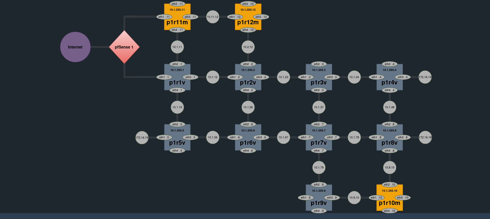
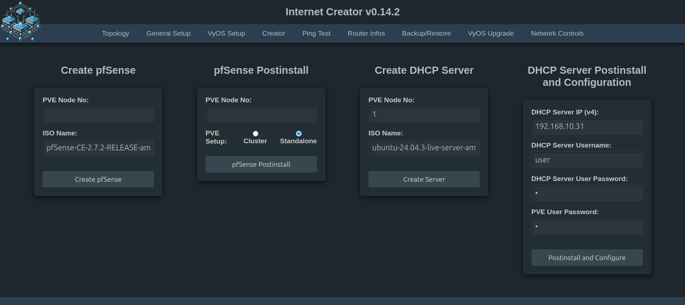
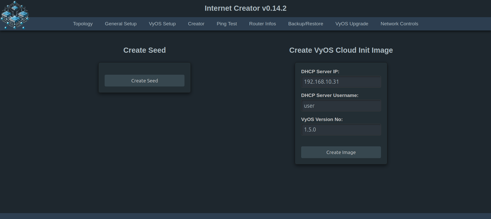
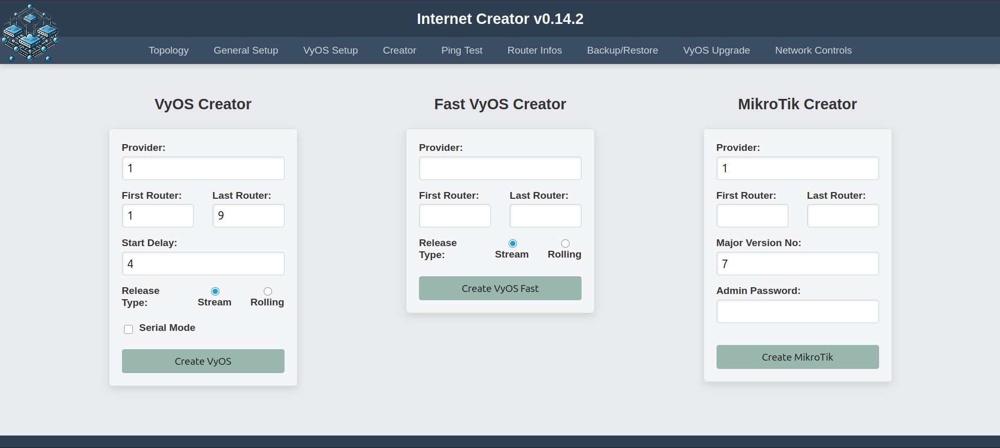
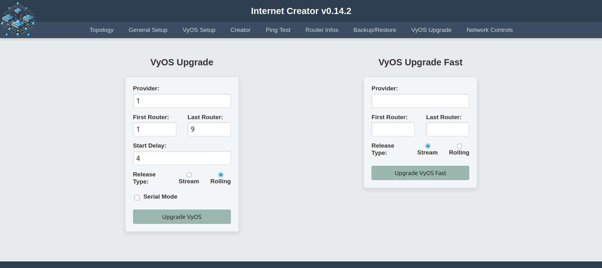

## Verwendungszwecke:

Es geht hier darum, drei Netzwerke (ISPs) bestehend aus jeweils 9 VyOS-Routern automatisiert unter PVE aufzusetzen und mit Ansible zu konfigurieren. ISP1 besteht zusätzlich aus 3 MikroTik Routern, die (zumindest vorläufig) über SSH konfiguriert werden. Der Internet Creator (INC) ist ein Ableger von [aibix' awesome setup (for) ISP learning](https://github.com/aibix0001/aasil), der u.a. darauf ausgelegt ist, sich bzgl. der Arbeitsgeschwindigkeit an die Gegebenheiten verschieden starker CPU's anzupassen: So gibt es einen Fast Modus für Rechner mit besonders starken CPUs, einen Normalmodus für schwächere CPUs und einen seriellen Modus für besonders schwache CPUs. Um den passenden Modus für die jeweils verwendete CPU zu finden, siehe den Abschnitt 'Erfahrungswerte' in der 'Beschreibung und Gebrauchshinweise zum INC v0.14.2.md'.
Das [Aibix-Projekt](https://www.twitch.tv/aibix0001) wendet sich u.a. an Auszubildende und Studenten im IT-Bereich, sowie weitere Interessierte, die nicht unbedingt immer drei Kraftpakete zur Verfügung haben. Der Internet Creator ist deshalb insbesondere auch zur Verwendung mit schwächeren Rechnern entwickelt worden.
Der Internet Creator ist außerdem dafür konzipiert, die Erstellung und Kontrolle der ISP-Netze möglichst komfortabel zu gestalten.

## Setup:
Bitte den Anweisungen unter 'Setup INC v0.14.2.md' folgen.

Ggf. Dark Reader ausschalten!

## Neue Features des INC v0.14

Die 'standalone' Upgrade-Funktion für VyOS Router außerhalb des Erzeugungsprozesses funktioniert wieder. Näheres dazu unter Gebrauchshinweise (14). Wer seinen VyOS Route Reflector nicht unter Rolling konfiguriert bekommen hat und deshalb erstmal Stream nehmen musste, aber trotzdem Rolling haben möchte, kann hier seinen bereits konfigurierten VyOS-Stream RR mit Rolling upgraden!

## Neue Features des INC v0.14.2

1\) Die Linux Bridges vmbr1 bis vmbr3 werden jetzt von _pfSense Postinstall_ automatisch angelegt. Im Fall des Clusterverbunds wird pro PVE-Host nur _ein_ LAN automatisch angelegt, im Standalone-Fall alle drei.

2\) Die iBGP-Konfiguration auf RouterOS ist an die Erfordernisse ab Version 7.19 angepasst worden.

3\) Kleine Verbesserungen des Layouts.

## Troubleshooting

Die Warnung: 

WARNING: This is a development server. Do not use it in a production deployment. Use a production WSGI server instead.

dürfte für die Erstellung von einem Netzwerk aus 12 Routern im lokalen Bereich irrelevant sein, da der hier verwendete Development-Server stark und sicher genug für diesen Zweck sein dürfte. 

Wenn bei der Ausführung irgendeiner Funktion Fehler auftreten, hilft es in der Regel, einen anderen Mode zu wählen und/oder weniger Router in einem Durchgang zu erstellen. 

Bei Ansible kann es in seltenen Fällen auch mal vorkommen, dass der eine oder andere Task fehlschlägt. In diesem Fall einfach wiederholen.

Sollte der (seltene) Fall eintreten, dass obwohl alles korrekt aussieht - die Configs der Router sind ok, es gibt ein DHCP-Lease von der pfSense usw. - es aber trotzdem nicht möglich ist, raus zu pingen, dann alle Router und die pfSense restarten. Wenn es dann immer noch nicht geht, mit anderem (meistens höherem) Delay-Wert oder ggf. im Fast Modus nochmal neu erzeugen. Es kann sein, dass dieses Problem etwas häufiger auftritt, wenn eine pfSense verwendet wird, die aus einem Restore eines Backups erstellt worden ist. In diesem Fall erstmal nur die pfSense neustarten, wenn das nicht reicht, sie erneut restoren und ansonsten händisch aufsetzen. Dieses letztgenannte Phänomen ist aber noch nicht genügend getestet, um zuverlässige Aussagen darüber machen zu können.
